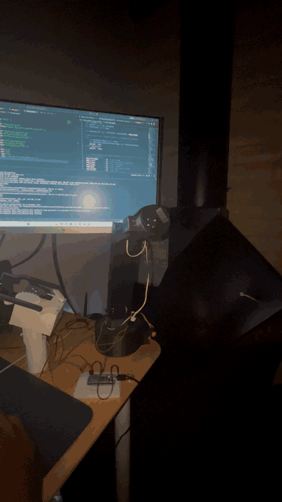
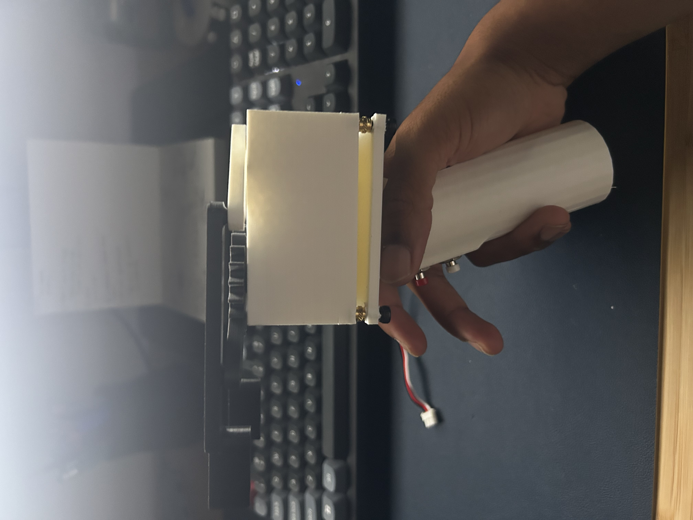

# ALFRED — 6DOF Robotic Arm

A 6-degree-of-freedom desktop robotic arm designed for kinesthetic-teach compliance and low-cost prototyping. Currently **5 of 6 joints operational**.



## Specs
- **6 DOF** revolute joints
- **0.3 m** workspace radius
- **500 g** payload target
- **Stepper-driven** joints in 3D-printed housings
- **ROS2** control stack (see [`src/`](src/))

## Joint assembly


## Roadmap
- [x] 5 of 6 joints operational
- [ ] Complete 6th joint (wrist roll)
- [ ] Custom gripper end-effector — in design
- [ ] Actuator upgrade using the [cycloidal gearbox](https://github.com/harrisonshan13/Cycloidal-Gearbox)

## Repo layout
```
├── Arm/                  SolidWorks assembly + parts for the arm
├── Gripper Test Stand/   SolidWorks assembly + parts for the test stand
├── src/                  ROS2 control stack
└── docs/                 renders, photos, videos
```

---

## Gripper Test Stand

Handheld test fixture for evaluating gripper end-effector variants side-by-side. Ergonomic pistol-grip form factor, trigger-actuated, with an onboard OLED for real-time feedback.

- **Trigger-driven** actuation via spur-gear reduction to opposing scissor-style jaws
- **Onboard OLED** for setpoint / position readout
- Removable battery + electronics stack for quick iteration
- **3D-printed** handle and housing designed for quick swap-out of gripper jaws

### Handle


### Mechanism (top-down)
Spur-gear reduction driving scissor jaws.


### Assembled — side profile


### Assembled — angled


---

## Contact

Harrison Lanfrank — harrisonshan13@gmail.com
