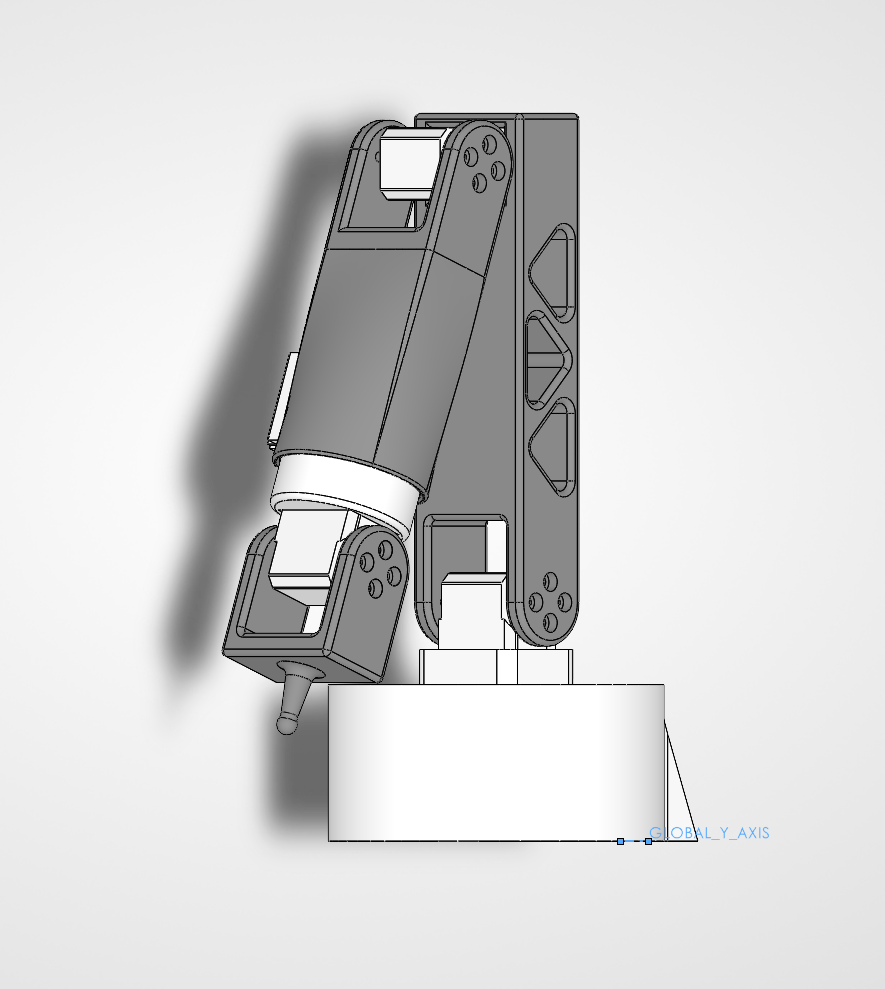

# ALFRED — 6DOF Robotic Arm

A 6-degree-of-freedom desktop robotic arm designed for kinesthetic-teach compliance and low-cost prototyping. Currently **5 of 6 joints operational**.

## Specs
- **6 DOF** revolute joints
- **0.3 m** workspace radius
- **500 g** payload target
- **Stepper-driven** joints in 3D-printed housings
- **ROS2** control stack (see [`src/`](src/))

## Joint assembly


## Repo layout
```
├── src/                     ROS2 code
├── cad/
│   ├── arm/                 SLDASM assembly + parts
│   └── gripper-test-stand/  test fixture for gripper variants (in progress)
└── docs/
    └── images/              CAD renders and progress shots
```

## Roadmap
- [x] 5 of 6 joints operational
- [ ] Complete 6th joint (wrist roll)
- [ ] Custom gripper end-effector — in design
- [ ] Gripper test stand for evaluating gripper variants
- [ ] Actuator upgrade using the [cycloidal gearbox](https://github.com/harrisonshan13/Cycloidal-Gearbox)

## Contact

Harrison Lanfrank — harrisonshan13@gmail.com
