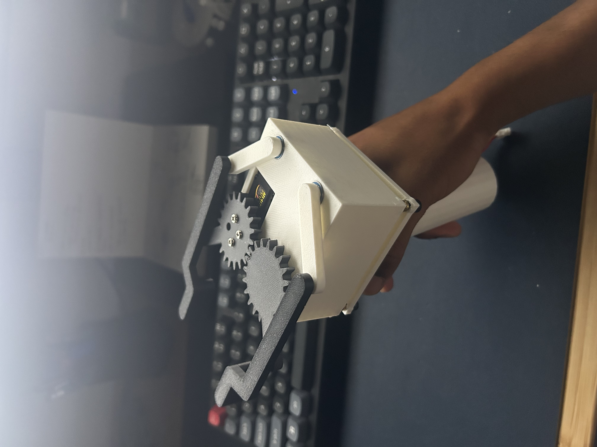

# ALFRED — 6DOF Robotic Arm

A 6-degree-of-freedom desktop robotic arm designed for kinesthetic-teach compliance and low-cost prototyping. Currently **5 of 6 joints operational**.

## Specs
- **6 DOF** revolute joints
- **0.3 m** workspace radius
- **500 g** payload target
- **Stepper-driven** joints in 3D-printed housings
- **ROS2** control stack (see [`src/`](src/))

## Joint assembly


## Roadmap
- [x] 5 of 6 joints operational
- [ ] Complete 6th joint (wrist roll)
- [ ] Custom gripper end-effector — in design
- [ ] Actuator upgrade using the [cycloidal gearbox](https://github.com/harrisonshan13/Cycloidal-Gearbox)

## Repo layout
```
├── Arm/                  SolidWorks assembly + parts for the arm
├── Gripper Test Stand/   SolidWorks assembly + parts for the test stand
├── src/                  ROS2 control stack
└── docs/images/          renders and progress shots
```

---

## Gripper Test Stand

Handheld test fixture for evaluating gripper end-effector variants. Ergonomic pistol-grip form factor, trigger-actuated for real-time feedback.
Enables quicker design iterations for gripper strategy. Portable nature allows for testing grip in different orientations similar to 6DOF arm.

- **Trigger-driven** actuation via spur-gear reduction. 4 bar linkage.
- **Onboard OLED** for setpoint / position readout - _in progress_
- **JST-connected** battery + electronics stack (removable for iteration) - _in progress_
- **3D-printed** handle and housing designed for quick swap-out of gripper jaws

### Handle


### Assembled — side profile



---


