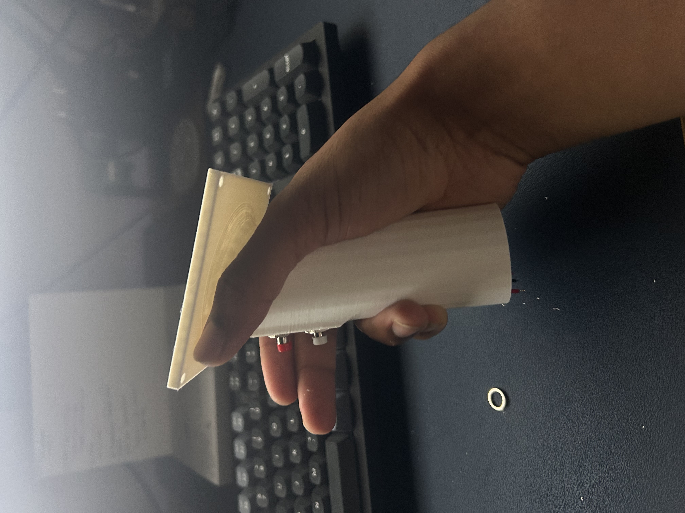
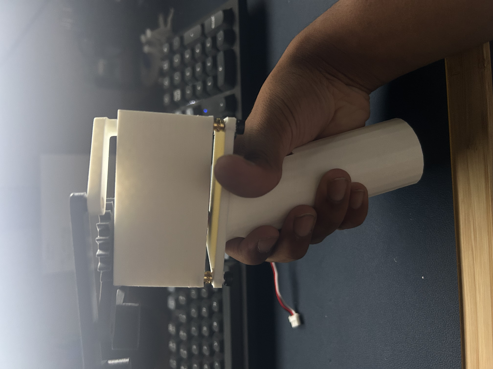

# Gripper Test Stand

Handheld test fixture for evaluating gripper end-effector variants side-by-side. Ergonomic pistol-grip form factor, trigger-actuated, with an onboard OLED for real-time feedback and JST-powered electronics.

## Overview

- **Trigger-driven** actuation via spur-gear reduction to opposing scissor-style jaws
- **Onboard OLED** display for setpoint / position readout
- **JST-connected** battery + electronics stack (removable for iteration)
- **3D-printed** handle and housing designed for quick swap-out of gripper jaws

## Photos

### Handle

### Mechanism (top-down)
Spur-gear reduction driving scissor jaws.

### Assembled — side profile

### Assembled — angled

## CAD
To be uploaded.
